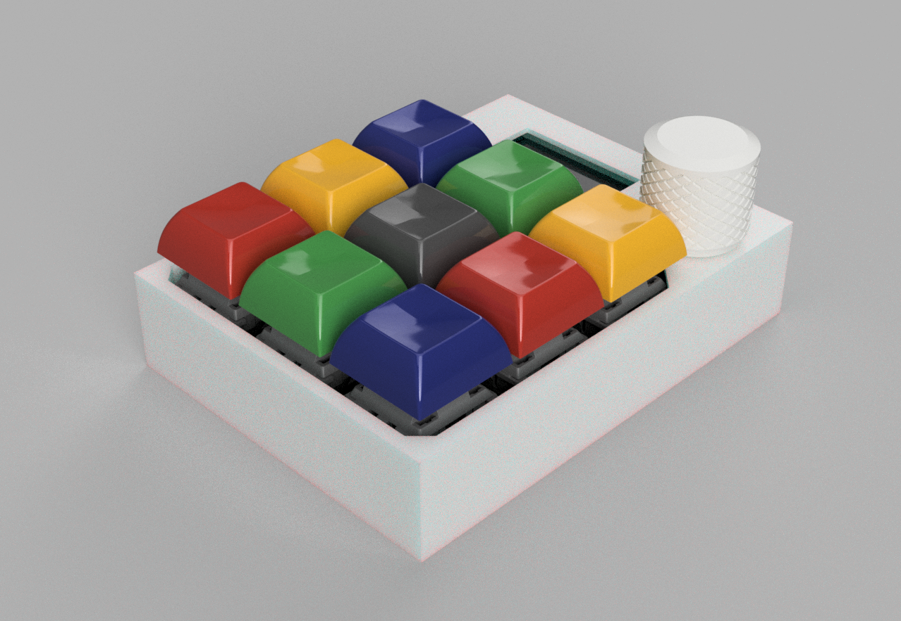
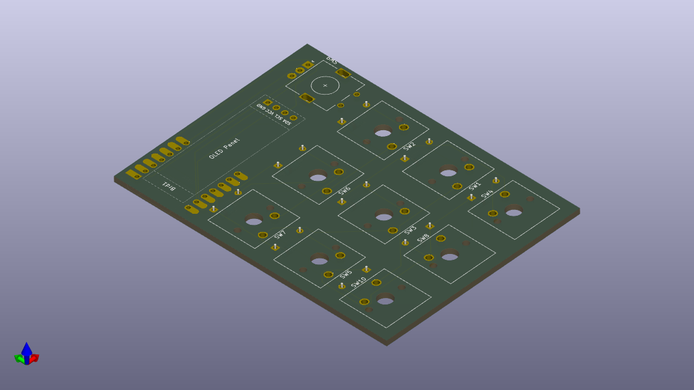
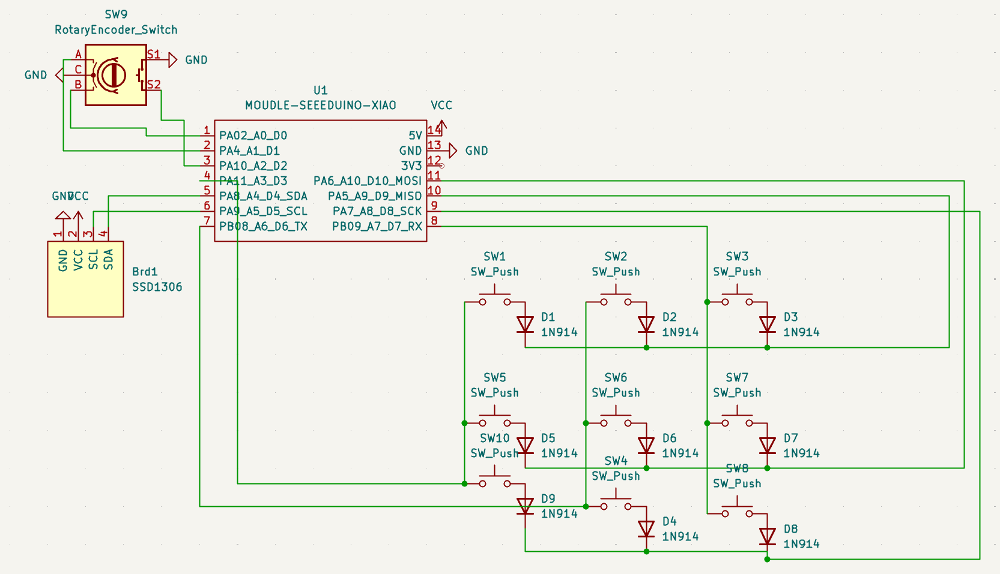
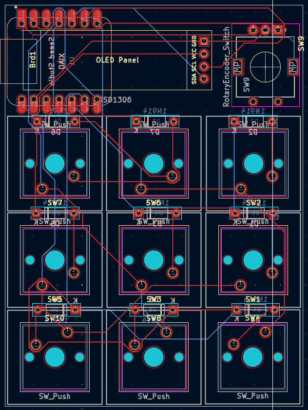
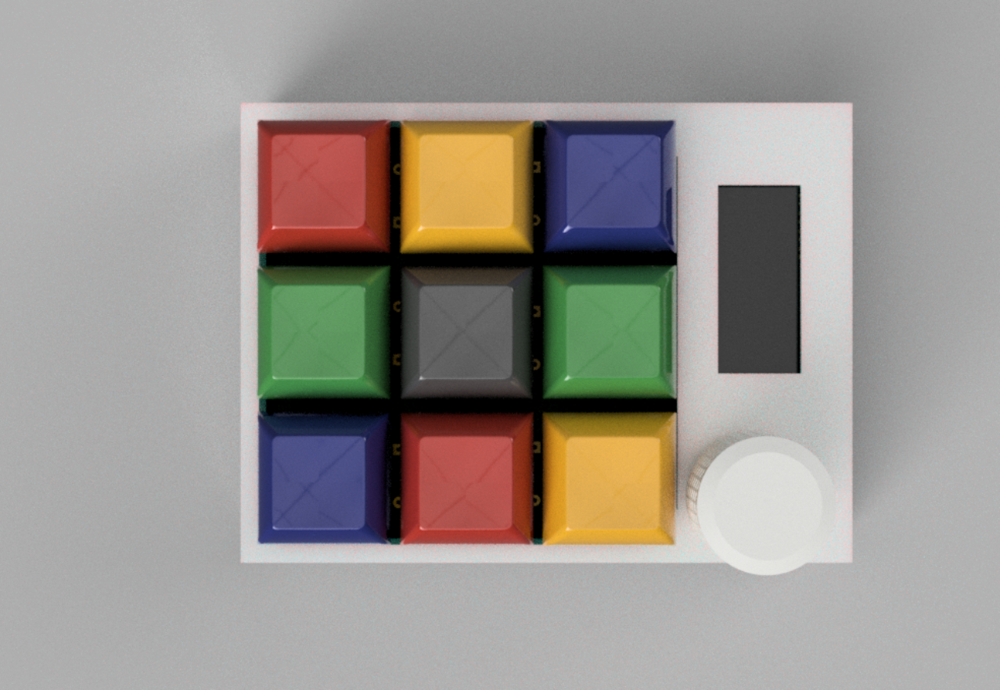
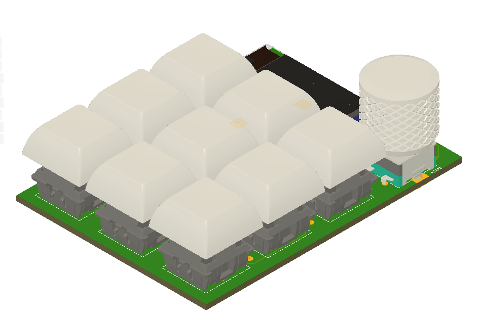
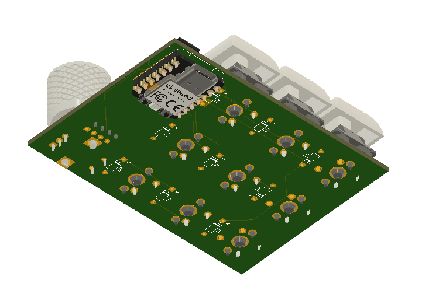
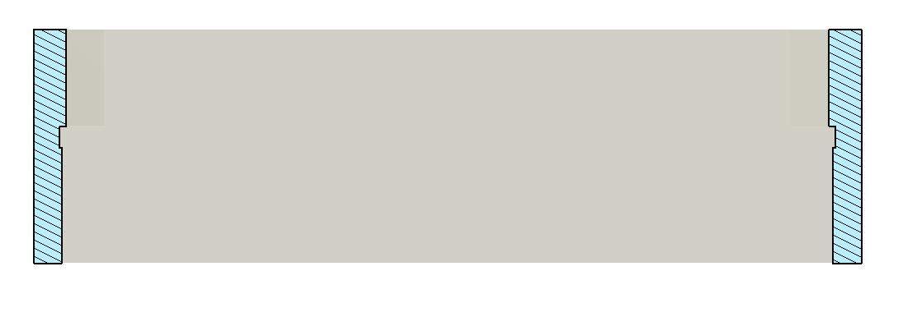

# My adaptation of the HackPad!

This is my adaptation of the blueprint hackpad by hackclub. I spent around 12 Hours on it, and used KiCad and Fusion360 for it's design

**Features**
- 9 Cherry MX Mechanical Switches in a 3x3 Arrangement 
- Rotary Encoder
- 0.96" OLED Display

  **PCB**
  

**CAD Model**

The case has a Lip where the PCB can snap in:

